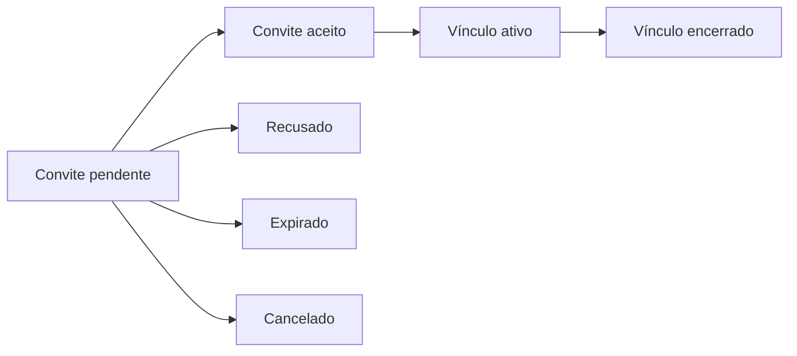

# Contas e regras de negócio

[Voltar ao índice](README.md)

**Atualizado em:** 06/09/2026.  
**Status:** regras aprovadas para orientar a implementação. As escolhas ainda abertas estão no [registro de decisões](07-planejamento-e-decisoes.md).

## Modelo de conta e acompanhamento

No protótipo, a seleção paciente/cuidador muda a navegação. Não existe identidade autenticada nem autorização efetiva.

A proposta é separar três conceitos:

| Conceito                  | Responsabilidade                                                                 |
| ------------------------- | -------------------------------------------------------------------------------- |
| Conta                     | Identificar quem acessa o aplicativo e guardar suas preferências de uso.         |
| Pessoa acompanhada        | Identificar de quem são os medicamentos, a rotina e os registros.                |
| Vínculo de acompanhamento | Relacionar uma conta a uma pessoa acompanhada, com permissões e estado próprios. |

Uma mesma conta poderá acompanhar sua rotina e a de outras pessoas. A interface terá os contextos “Minha rotina” e “Pessoas que acompanho”, com identificação visível da pessoa selecionada.

A existência de pessoas acompanhadas sem conta própria continua pendente. O fluxo inicial de convite abaixo pressupõe que a pessoa possa autorizar o compartilhamento; ele não resolve, por si só, representação ou cadastro assistido.

## Gerenciamento de conta implementado

- Cadastro, verificação do contato, entrada e recuperação de acesso.
- Edição de nome e contato e alteração de senha.
- Identificação da sessão atual e encerramento das outras sessões conectadas.
- Preferências de notificações, acessibilidade e fuso horário.
- Revisão dos acessos concedidos e exportação JSON das próprias informações.
- Encerramento autenticado da conta, com explicação dos efeitos nos dados e vínculos.

Trocas de e-mail ou senha exigem nova confirmação de identidade. A recuperação emprega links temporários do Supabase Auth. Referências: [OWASP — autenticação](https://cheatsheetseries.owasp.org/cheatsheets/Authentication_Cheat_Sheet.html) e [recuperação de senha](https://cheatsheetseries.owasp.org/cheatsheets/Forgot_Password_Cheat_Sheet.html).

## Convites e vínculos

O convite pode estar pendente, aceito, recusado, expirado ou cancelado. Sua aceitação cria um vínculo ativo; a revogação encerra esse vínculo. Convite aceito e vínculo ativo são conceitos diferentes: a autorização pode ser retirada depois do aceite.

O acesso começa após o aceite e a ativação do vínculo. O paciente pode revogá-lo, e o acompanhante pode deixar de acompanhar a pessoa. Convites ainda pendentes não concedem acesso aos medicamentos ou registros.

## Matriz de permissões proposta

Esta matriz descreve permissões por vínculo. O nome da relação, como “Filho” ou “Cuidador”, não concede permissões automaticamente.

| Operação sobre a rotina acompanhada                 | Regra proposta para o acompanhante                               |
| --------------------------------------------------- | ---------------------------------------------------------------- |
| Consultar medicamentos e horários                   | Exige permissão de consulta de medicamentos.                     |
| Consultar histórico                                 | Exige permissão de consulta de histórico.                        |
| Consultar indicadores                               | Exige permissão de consulta de indicadores.                      |
| Receber alertas                                     | Exige permissão de alertas e preferência de recebimento ativa.   |
| Registrar uma dose em nome do paciente              | Exige permissão específica de registro e preservação da autoria. |
| Gerenciar medicamentos e horários cadastrados       | Exige permissão específica de gerenciamento da rotina.           |
| Alterar credenciais ou encerrar a conta do paciente | Não faz parte das permissões de acompanhamento propostas.        |
| Conceder acesso a outra pessoa                      | Não é concedido automaticamente ao acompanhante.                 |

As permissões precisam ser verificadas no servidor para a pessoa e a operação solicitadas. A exibição de botões não constitui controle de acesso. Referência: [OWASP — autorização](https://cheatsheetseries.owasp.org/cheatsheets/Authorization_Cheat_Sheet.html).

## Regras de negócio propostas

| ID    | Regra                                                                                                                                               |
| ----- | --------------------------------------------------------------------------------------------------------------------------------------------------- |
| RN-01 | Toda operação sobre uma rotina identifica a pessoa acompanhada e a conta responsável.                                                               |
| RN-02 | Acesso compartilhado depende de vínculo ativo e permissão específica para a operação.                                                               |
| RN-03 | Revogar um vínculo impede novas consultas e alterações por esse vínculo. Dados já exportados não são recuperados pelo aplicativo.                   |
| RN-04 | Gerenciar a programação cadastrada não atribui autoridade para emitir ou alterar uma prescrição clínica.                                            |
| RN-05 | Medicamento, programação e ocorrência de dose são registros distintos. Uma programação pode gerar várias ocorrências.                               |
| RN-06 | Cada ocorrência de dose tem identificador, medicamento e horário previsto; um registro informa seu resultado e autoria.                             |
| RN-07 | “Tomada”, “não tomada” e “sem registro” representam situações distintas. Atraso depende do horário e não comprova ausência de tomada.               |
| RN-08 | Registrar ou corrigir uma ocorrência atualiza a mesma informação no dia, histórico e acompanhamento autorizado.                                     |
| RN-09 | Repetir uma solicitação de confirmação não cria duas tomadas para a mesma ocorrência. Conflitos entre dispositivos precisam de resolução explícita. |
| RN-10 | Guardar separadamente horário previsto, horário de tomada informado e instante em que o registro foi realizado.                                     |
| RN-11 | Correções preservam a identificação da alteração e de seu autor; o período de retenção desses dados precisa ser definido.                           |
| RN-12 | Alterações de programação valem a partir de uma data definida e preservam o histórico anterior.                                                     |
| RN-13 | Arquivar um medicamento encerra a geração de doses futuras sem apagar os registros anteriores.                                                      |
| RN-14 | Adiar um lembrete não altera automaticamente o horário previsto da dose.                                                                            |
| RN-15 | Uma dose resolvida deixa de gerar os lembretes pendentes correspondentes.                                                                           |
| RN-16 | Indicadores mostram período, numerador e denominador e são calculados a partir de registros, conforme regra de cálculo a definir.                   |
| RN-17 | Se houver uso sem conexão, a interface identifica registros pendentes de sincronização e a data da última atualização.                              |
| RN-18 | Encerrar a conta de um acompanhante encerra seus vínculos sem apagar o histórico pertencente à pessoa acompanhada.                                  |

## Exemplo de comportamento desejado

Maria tem cinco doses previstas no dia e duas tomadas registradas. Ao registrar a terceira ocorrência, o resumo passa a três de cinco, e o histórico identifica exatamente a dose alterada. Carlos recebe a atualização somente se possuir o vínculo e as permissões correspondentes.

Se Carlos puder registrar em nome de Maria, a informação deve aparecer como “Registrada por Carlos”. Uma nova tentativa sobre a mesma ocorrência deve apresentar o registro existente ou um conflito a resolver, sem incrementar novamente o total.

## Decisões ainda abertas

Ainda precisa ser definido o cadastro assistido sem conta própria. Exclusão, fusos, indicadores e limites de alertas foram decididos e implementados na Etapa 3.

Esses pontos não impedem a documentação; devem orientar as primeiras decisões de produto registradas no documento 07.
