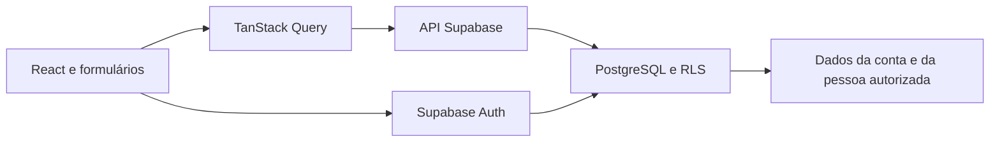

# Organização técnica e do trabalho

[Voltar ao índice](README.md)

**Atualizado em:** 06/09/2026.  
**Escopo:** arquitetura aprovada e estrutura atual das Etapas 1 a 3.

## Ferramentas configuradas

| Área                 | Ferramentas                                   | Papel                                                |
| -------------------- | --------------------------------------------- | ---------------------------------------------------- |
| Interface            | React 19, TypeScript, Vite 8 e Tailwind CSS 4 | Aplicação web, tipos, build e estilos.               |
| Navegação e dados    | React Router e TanStack Query                 | URLs, rotas protegidas, cache e estados assíncronos. |
| Formulários          | React Hook Form e Zod                         | Entrada, mensagens e validação.                      |
| Backend              | Supabase Auth, PostgreSQL e RLS               | Identidade, persistência e autorização.              |
| Aplicação instalável | vite-plugin-pwa                               | Manifesto, service worker e atualização.             |
| Qualidade            | ESLint, oxfmt e TypeScript                    | Análise estática, formato e tipos.                   |
| Testes               | Vitest, Testing Library e Playwright          | Testes unitários, de componentes e de percurso.      |
| Ambiente             | Node.js 22, pnpm 10, Supabase CLI e Docker    | Execução local e banco reproduzível.                 |

O push em segundo plano com OneSignal, Edge Functions/Cron, Sentry e a automação de CI permanecem
previstos para etapas posteriores. A central de notificações no app e os avisos com o navegador
aberto já estão implementados.

## Estrutura atual

```text
Medcare/
├── docs/                         # Produto, requisitos, decisões e estado
├── src/
│   ├── app/                      # Shell, início e proteção de rotas
│   ├── auth/                     # Sessão e contexto de autenticação
│   ├── features/
│   │   ├── auth/                 # Cadastro, acesso e recuperação
│   │   ├── account/              # Perfil, credenciais e preferências
│   │   ├── care/                  # Convites, vínculos e permissões
│   │   ├── doses/                 # Hoje, agenda, histórico e registros
│   │   ├── insights/              # Indicadores de adesão
│   │   ├── medications/           # Medicamentos, horários e vigência
│   │   └── notifications/         # Lembretes, alertas e adiamento
│   ├── lib/                      # Cliente Supabase e tratamento de erros
│   ├── test/                     # Configuração dos testes
│   ├── App.tsx                   # Entrada do aplicativo
│   ├── PrototypeApp.tsx          # Protótipo visual preservado
│   ├── Root.tsx                  # Roteador e provedores
│   ├── main.tsx                  # Entrada React
│   └── types.ts                  # Tipos do domínio
├── supabase/
│   ├── migrations/               # Esquema versionado e políticas RLS
│   ├── config.toml               # Serviços locais
│   └── seed.sql                  # Dados locais opcionais
├── eslint.config.js
├── playwright.config.ts
├── vitest.config.ts
└── vite.config.ts
```

## Fluxo da aplicação



O detalhamento dos módulos e suas relações está em
[Arquitetura baseada em componentes](12-arquitetura-baseada-em-componentes.md), incluindo o
diagrama de componentes do MedCare.

## Comandos

| Comando                             | Finalidade                                        |
| ----------------------------------- | ------------------------------------------------- |
| `pnpm dev`                          | Servidor de desenvolvimento.                      |
| `pnpm build`                        | Tipos e build de produção.                        |
| `pnpm format` / `pnpm format:check` | Aplicar ou conferir o formato.                    |
| `pnpm lint`                         | Executar ESLint.                                  |
| `pnpm typecheck`                    | Verificar TypeScript.                             |
| `pnpm test`                         | Executar testes unitários.                        |
| `pnpm test:e2e`                     | Executar percursos Playwright quando adicionados. |
| `pnpm check`                        | Executar a checagem completa.                     |
| `pnpm supabase:start`               | Iniciar os serviços locais.                       |
| `pnpm supabase:reset`               | Recriar o banco e reaplicar migrações.            |

## Organização das entregas

Cada etapa deve implementar um percurso completo, conferir persistência e autorização e então atualizar o [estado atual](06-estado-atual.md). As mudanças de produto ou tecnologia devem ser registradas em [planejamento e decisões](07-planejamento-e-decisoes.md).

## Prévia em dispositivos

O Vite e as portas locais do Supabase escutam na rede do computador. A prévia integrada usa `localhost:8443`; um celular na mesma rede usa o endereço IPv4 do computador e a mesma porta. Durante o desenvolvimento, o cliente Supabase adapta a URL de loopback ao host pelo qual a página foi aberta.

Essa prévia HTTP permite conferir layout, formulários e fluxos no navegador móvel. Service worker instalável e push em dispositivo físico dependem do ambiente HTTPS de homologação.
