# Arquitetura baseada em componentes do MedCare

[Voltar ao índice](README.md)

**Atualizado em:** 09/09/2026.
**Escopo:** aplicação funcional React e backend Supabase.

## Visão geral

O MedCare aplica arquitetura baseada em componentes no frontend. A interface é construída pela
composição de componentes React, e as funcionalidades são agrupadas por domínio em `src/features`.
O projeto também separa os componentes de interface, o estado compartilhado, o acesso a dados e
as regras protegidas pelo banco.

A aplicação possui duas áreas principais de execução:

1. **Web App/PWA:** aplicação React executada no navegador e publicada como arquivos estáticos;
2. **Supabase:** backend gerenciado com autenticação, API, funções PostgreSQL, banco e políticas
   Row Level Security.

O MedCare não possui um servidor Node.js próprio. O frontend usa `supabase-js` para acessar o
Supabase por HTTPS. O token da sessão identifica o usuário, e o banco aplica as regras de acesso.

## Componente React e componente arquitetural

Os dois termos representam níveis diferentes:

| Termo                   | Significado no MedCare                                    | Exemplo                                                        |
| ----------------------- | --------------------------------------------------------- | -------------------------------------------------------------- |
| Componente React        | Unidade de interface ou composição implementada em TSX.   | `DoseCard`, `PasswordField`, `AppShell`.                       |
| Componente arquitetural | Módulo coeso com responsabilidade e interfaces definidas. | Gestão de doses, cuidado compartilhado, autenticação e acesso. |

Um componente arquitetural pode conter várias páginas, componentes React, hooks e módulos TypeScript. Por
exemplo, o componente arquitetural **Gestão de doses** contém `TodayPage`, `AgendaPage`, `HistoryPage`,
`DoseDetailsPage`, `DoseCard`, `api.ts` e `utils.ts`.

## Diagrama de componentes

O diagrama representa os componentes de software do MedCare, suas dependências e as interfaces
usadas para comunicação. Os agrupamentos indicam onde cada componente é executado; eles não
impõem um método adicional de modelagem.

```mermaid
flowchart LR
    pessoa["Paciente ou cuidador"]

    subgraph frontend["Frontend MedCare - React e PWA"]
        entrada["Componente: inicialização e roteamento"]
        acesso["Componente: sessão e controle de acesso"]
        shell["Componente: shell e navegação"]
        contexto["Componente: contexto do paciente e permissões"]
        authUi["Componente: cadastro e autenticação"]
        conta["Componente: perfil e conta"]
        medicamentos["Componente: gestão de medicamentos"]
        doses["Componente: gestão de doses"]
        cuidados["Componente: cuidado compartilhado"]
        indicadores["Componente: indicadores de adesão"]
        notificacoes["Componente: central de notificações"]
        dados["Componente: adaptadores de dados"]
        pwa["Componente: instalação e cache PWA"]
    end

    authInterface(("Interface de autenticação"))
    dataInterface(("Interface de dados e RPC"))
    browserInterface(("Interface do navegador"))

    subgraph backend["Backend Supabase"]
        supaAuth["Componente: Supabase Auth"]
        api["Componente: API PostgREST e RPC"]
        regras["Componente: serviços de domínio SQL"]
        autorizacao["Componente: autorização RLS"]
        eventos["Componente: gatilhos e notificações"]
        persistencia[("Componente: banco PostgreSQL")]
    end

    navegador["APIs do navegador"]
    email["Serviço de e-mail"]

    pessoa -->|"utiliza"| entrada
    entrada -->|"monta as rotas"| acesso
    entrada --> authUi
    acesso -->|"libera a área autenticada"| shell
    shell --> contexto
    shell --> conta
    contexto --> medicamentos
    contexto --> doses
    contexto --> cuidados
    contexto --> indicadores
    contexto --> notificacoes

    authUi --> dados
    acesso --> dados
    conta --> dados
    medicamentos --> dados
    doses --> dados
    cuidados --> dados
    indicadores --> dados
    notificacoes --> dados

    dados --> authInterface
    dados --> dataInterface
    authInterface --> supaAuth
    dataInterface --> api
    supaAuth -->|"envia confirmação e recuperação"| email
    supaAuth -->|"fornece identidade da sessão"| api
    api --> regras
    api --> autorizacao
    regras --> autorizacao
    autorizacao --> persistencia
    regras --> persistencia
    eventos --> persistencia

    entrada --> pwa
    pwa --> browserInterface
    notificacoes --> browserInterface
    browserInterface --> navegador

    classDef person fill:#374151,color:#fff,stroke:#111827,stroke-width:2px
    classDef frontendComponent fill:#d1fae5,color:#064e3b,stroke:#047857,stroke-width:1.5px
    classDef backendComponent fill:#dbeafe,color:#1e3a8a,stroke:#2563eb,stroke-width:1.5px
    classDef interface fill:#fef3c7,color:#78350f,stroke:#d97706,stroke-width:1.5px
    classDef external fill:#f3f4f6,color:#1f2937,stroke:#6b7280,stroke-width:1.5px

    class pessoa person
    class entrada,acesso,shell,contexto,authUi,conta,medicamentos,doses,cuidados,indicadores,notificacoes,dados,pwa frontendComponent
    class supaAuth,api,regras,autorizacao,eventos,persistencia backendComponent
    class authInterface,dataInterface,browserInterface interface
    class navegador,email external
```



## Catálogo dos componentes

| Área        | Componente                     | Responsabilidade                                                                                | Implementação principal                        |
| ----------- | ------------------------------ | ----------------------------------------------------------------------------------------------- | ---------------------------------------------- |
| Web App/PWA | Inicialização e roteamento     | Montar a árvore React, registrar provedores, declarar rotas e carregar módulos sob demanda.     | `src/main.tsx`, `src/App.tsx`, `src/Root.tsx`  |
| Web App/PWA | Sessão e controle de acesso    | Restaurar sessão, observar mudanças de autenticação e impedir acesso anônimo às rotas privadas. | `src/auth`, `src/app/ProtectedRoute.tsx`       |
| Web App/PWA | Shell e navegação              | Exibir cabeçalho, menus, conteúdo de rota, instalação e estado offline.                         | `src/app/AppShell.tsx`                         |
| Web App/PWA | Contexto da pessoa acompanhada | Listar pacientes acessíveis, manter a seleção atual e calcular permissões da interface.         | `src/features/care/PatientContext.tsx`         |
| Web App/PWA | Cadastro e autenticação        | Cadastro, login, confirmação, recuperação e redefinição de senha.                               | `src/features/auth`                            |
| Web App/PWA | Perfil e conta                 | Dados pessoais, acessibilidade, lembretes, credenciais, exportação, sessões e exclusão.         | `src/features/account`                         |
| Web App/PWA | Gestão de medicamentos         | Cadastrar, validar, listar, editar, versionar e arquivar rotinas.                               | `src/features/medications`                     |
| Web App/PWA | Gestão de doses                | Exibir hoje, agenda e histórico; registrar e corrigir doses com auditoria.                      | `src/features/doses`                           |
| Web App/PWA | Cuidado compartilhado          | Convites, aceite, recusa, vínculos, permissões e revogação.                                     | `src/features/care`                            |
| Web App/PWA | Indicadores de adesão          | Calcular e apresentar métricas de 7, 30 e 90 dias.                                              | `src/features/insights`                        |
| Web App/PWA | Central de notificações        | Consultar avisos, marcar como lido, abrir o item e adiar lembretes.                             | `src/features/notifications`                   |
| Web App/PWA | Adaptadores de dados           | Configurar o cliente Supabase e oferecer operações tipadas por funcionalidade.                  | `src/lib/supabase.ts`, `src/features/*/api.ts` |
| Web App/PWA | Instalação e cache PWA         | Manifesto, service worker, prompt de instalação e shell disponível offline.                     | `vite.config.ts`, `useInstallPrompt.ts`        |
| Supabase    | Autenticação                   | Gerenciar usuários, sessões e fluxos de e-mail.                                                 | Supabase Auth e trigger `handle_new_user`      |
| Supabase    | API de dados                   | Expor tabelas e funções permitidas ao cliente autenticado.                                      | PostgREST e RPC                                |
| Supabase    | Serviços de domínio            | Executar operações transacionais de medicamentos, doses, convites, indicadores e conta.         | Funções em `supabase/migrations`               |
| Supabase    | Autorização                    | Restringir dados por usuário, paciente e permissão do vínculo.                                  | RLS e `has_patient_permission`                 |
| Supabase    | Persistência                   | Armazenar perfis, pacientes, rotinas, ocorrências, eventos, vínculos e notificações.            | PostgreSQL                                     |
| Supabase    | Gatilhos e notificações        | Criar perfil do novo usuário, manter datas e gerar/atualizar avisos.                            | Triggers e funções SQL                         |

## Conceitos de arquitetura de componentes aplicados

### 1. Composição de componentes

O projeto monta componentes maiores a partir de componentes menores. `Root` compõe os provedores
e o roteador; `AppShell` compõe cabeçalho, navegação, seletor de paciente e o conteúdo da rota;
páginas de doses reutilizam `DoseCard`. Não existe hierarquia de classes ou herança de componentes.

### 2. Separação por funcionalidades

Os módulos são organizados pelo domínio de negócio em vez de separar todos os arquivos apenas por
tipo técnico. Cada pasta de `src/features` reúne página, validação, acesso a dados, utilitários e
testes relacionados à mesma função. Isso reduz o acoplamento entre áreas e facilita atribuir uma
funcionalidade a uma equipe.

### 3. Responsabilidade única e coesão

Os componentes compartilhados possuem objetivos delimitados:

- `ProtectedRoute` decide se uma rota autenticada pode ser exibida;
- `AuthProvider` mantém a sessão;
- `PatientProvider` mantém paciente selecionado e permissões;
- `DoseCard` apresenta uma ocorrência;
- os arquivos `api.ts` executam operações remotas da funcionalidade.

Algumas páginas ainda coordenam formulário, mutação e apresentação no mesmo arquivo. Essa é uma
decisão aceitável no tamanho atual, mas formulários maiores poderão ser extraídos quando tiverem
reuso ou regras independentes.

### 4. Interfaces e contratos explícitos

TypeScript define contratos entre componentes por propriedades, contextos e tipos de domínio em
`src/types.ts`. Zod valida dados de formulários antes das operações remotas. As funções RPC do
PostgreSQL formam contratos transacionais para ações como registrar dose, atualizar rotina e
responder convite.

### 5. Fluxo de dados previsível

Os dados seguem um fluxo principal:

```text
interação do usuário
→ componente React
→ hook/mutação do TanStack Query
→ adaptador api.ts
→ cliente Supabase
→ API/RPC + RLS
→ PostgreSQL
→ invalidação do cache
→ nova renderização
```

As propriedades descem pela árvore de componentes e os eventos sobem por callbacks. Dados globais
limitados são distribuídos por Context, evitando uma variável global única para toda a aplicação.

### 6. Estado separado por finalidade

O MedCare usa mecanismos diferentes conforme a natureza do estado:

- `useState` e React Hook Form para estado temporário da interface;
- TanStack Query para dados remotos, cache, carregamento, erro e invalidação;
- `AuthContext` para a sessão atual;
- `PatientContext` para a pessoa acompanhada e suas permissões;
- `localStorage` somente para preferências locais, como a última pessoa selecionada e avisos já
  exibidos pelo navegador;
- PostgreSQL como fonte definitiva dos dados do domínio.

### 7. Componentes com ciclo de vida controlado

Os efeitos registram e removem listeners, acompanham sessão e conectividade e sincronizam
preferências. Os retornos de limpeza de `useEffect` evitam manter subscriptions e listeners depois
que um componente deixa a tela.

### 8. Carregamento sob demanda e limites de espera

As funcionalidades autenticadas usam `lazy` e `Suspense`. O navegador baixa páginas como doses,
medicamentos, cuidados e indicadores quando elas são necessárias. `RouteFallback` oferece um estado
visível enquanto o módulo é carregado.

### 9. Reutilização sem criar abstrações prematuras

Elementos repetidos com comportamento próprio foram extraídos, como `PasswordField`, `FormNotice`,
`DoseCard` e `PermissionOptions`. Páginas específicas permanecem dentro do domínio correspondente.
Esse equilíbrio evita duplicação e também evita componentes genéricos difíceis de compreender.

### 10. Autorização em profundidade

Os componentes escondem ou bloqueiam ações conforme `can(permission)`, melhorando a experiência.
A segurança não depende dessa renderização: as funções SQL e políticas RLS repetem a validação no
backend. Assim, alterar o JavaScript no navegador não concede acesso a outro paciente.

### 11. Estados explícitos de interface

As páginas apresentam carregamento, sucesso, vazio, erro, ausência de permissão e falta de conexão.
Os componentes desabilitam ações durante mutações para reduzir envios repetidos. Operações críticas
do backend também usam versão esperada, transação e identificador idempotente quando necessário.

### 12. Testabilidade por unidades

Validações, resolução de URL e cálculo de estado foram mantidos em funções que podem ser testadas
sem renderizar toda a aplicação. Os testes atuais cobrem esquemas de autenticação e medicamentos,
estados de dose e configuração do Supabase. Os componentes de página também possuem dependências
claras para futuros testes de integração.

## Limites e melhorias arquiteturais

A arquitetura atual é adequada ao porte do projeto, mas ainda possui pontos de evolução:

1. `PrototypeApp.tsx` preserva o protótipo original e concentra muitos componentes e dados
   simulados; ele não representa a arquitetura da aplicação funcional em `/app`.
2. Os estilos funcionais estão concentrados em `account.css`; tokens e componentes visuais poderão
   formar uma biblioteca de interface quando surgir reuso suficiente.
3. Algumas páginas grandes, como conta e formulário de medicamento, podem ser divididas em seções
   de formulário quando a equipe precisar desenvolvê-las em paralelo.
4. Os adaptadores `api.ts` usam diretamente o cliente Supabase. Uma interface de repositório só se
   justifica se houver outro backend, modo offline gravável ou necessidade maior de mocks.
5. O push em segundo plano exigirá um componente de servidor, como Edge Function e agendamento,
   sem colocar chaves administrativas no frontend.
6. Testes de componente e percursos E2E devem complementar os testes unitários à medida que os
   fluxos se estabilizarem.

## Regras para manter a arquitetura

Ao adicionar uma funcionalidade:

1. crie ou use uma pasta de domínio em `src/features`;
2. mantenha regras de validação fora do JSX quando puderem ser testadas isoladamente;
3. coloque operações Supabase no `api.ts` da funcionalidade;
4. use tipos explícitos para propriedades, respostas e comandos;
5. extraia um componente quando houver reuso, comportamento próprio ou redução clara de
   complexidade;
6. mantenha a autorização efetiva em RLS/funções SQL e use permissões no frontend para orientar a
   interface;
7. represente carregamento, erro, vazio, sucesso e falta de permissão;
8. adicione a rota e o limite de `Suspense` em `Root.tsx` quando a página puder ser carregada sob
   demanda;
9. atualize este diagrama quando um novo componente arquitetural, interface ou relacionamento
   relevante for criado.
